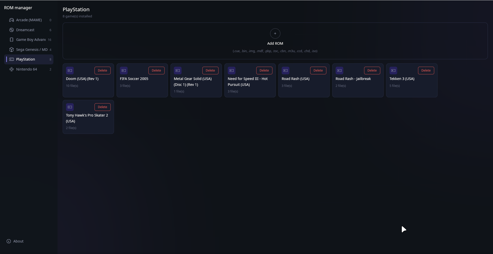
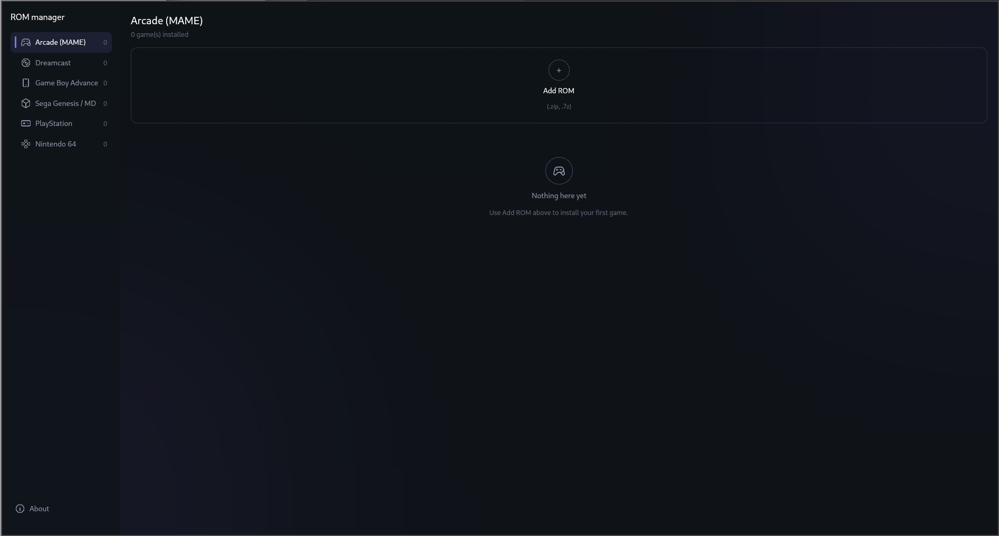
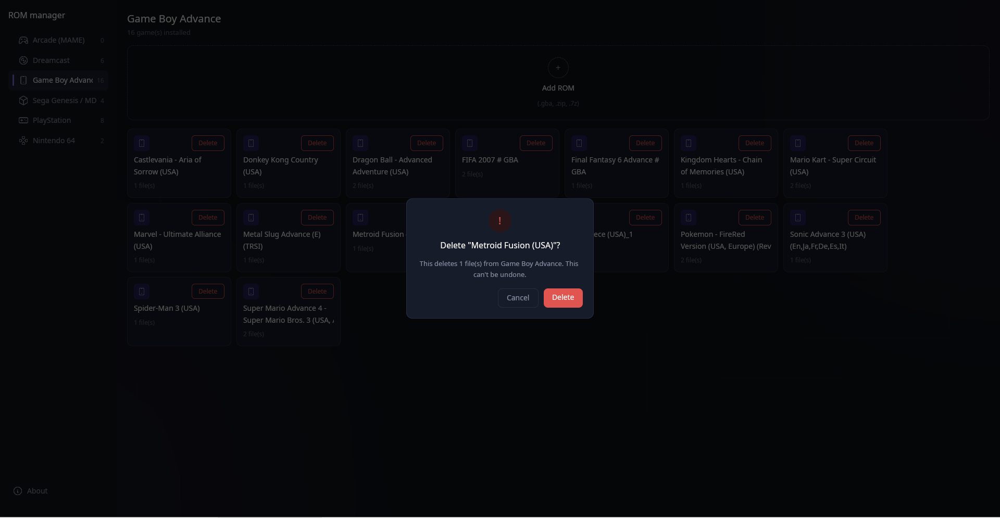

# RetroPie ROM Manager

[](https://github.com/fa-saikat/retropie-rom-installer/releases/latest)
[](LICENSE)

A fast, simple desktop GUI for installing and uninstalling RetroPie ROMs on Linux — pick a system, pick your downloaded files, done. Multi-file games stay one tidy entry.



## Features

- **Six systems out of the box** — Arcade (MAME), Dreamcast, Game Boy Advance, Sega Genesis / MD, PlayStation, Nintendo 64, each with its own icon, accent, and accepted file types.
- **Install from downloads** — drop ROM files onto the window or pick them in the native file picker; matching files are copied straight into `~/RetroPie/roms/<system>`, zips are extracted automatically (standard zips in-process, tricky ones via `unzip`/`7z` fallbacks).
- **Multi-file games collapse into one entry** — a PSX game spread across a `.cue`, six track `.bin`s, and a generated `.srm` shows up once, as `Doom (USA) (Rev 1)`.
- **Uninstall removes everything** — deleting that entry removes every file recorded for it, so no orphaned track bins or save files linger.
- **Safe by construction** — every delete asks first, and the confirm dialog tells you exactly how many files go away.
- **Box art and metadata, no manual scraping** — after an install the app runs RetroPie's own scraper, [Skyscraper](https://github.com/Gemba/skyscraper), for that game, so EmulationStation shows cover art, screenshots and descriptions right away. Uninstalling also removes the game's scraped media.



## Install

Download the `.deb` from the [latest release](https://github.com/fa-saikat/retropie-rom-installer/releases/latest), then:

```
sudo dpkg -i retropie-rom-manager_*_amd64.deb
sudo apt-get install -f   # only if dpkg reports missing dependencies
```

Optional helpers the app will use when present: `unzip` (stubborn zips), `p7zip-full` (multi-part archives).

## Usage

1. **Pick a system** in the left sidebar — the header shows how many games and files are installed.
2. **Add ROMs** with the Add ROM button, the Add ROM tile (it lists the accepted formats), or by dropping files anywhere on the window.
3. **Browse one entry per game** as a box-art grid or a list; `/` jumps to search.
4. **Click a game** for its details: description, release info, which artwork was saved, and every file on disk with its size.
5. **Delete** from the card (hover it), the list or the details panel — confirm once, and every file belonging to the game, plus its scraped artwork, is removed.



## Artwork and metadata

Scraping goes through Skyscraper, the scraper RetroPie ships as an optional package. It brings its own ScreenScraper / TheGamesDB access, so there are no API keys to set up.

If it isn't installed yet, the app offers to install it: **Install Skyscraper** runs `retropie_packages.sh skyscraper _auto_` from `~/RetroPie-Setup`, exactly like **Manage packages → opt → skyscraper**, and shows the installer's output as it goes. It needs root, so it uses `sudo` when that works without a password (the RetroPie default) and otherwise `pkexec`, which asks for your password; either way it installs for your user, not root. Building can take 10–20 minutes on a Raspberry Pi. When it's done, games without artwork are scraped straight away. Without RetroPie-Setup (or any way to get root) the app shows the command to run instead. The app runs it exactly the way RetroPie's Skyscraper menu does and honours the same settings file (`/opt/retropie/configs/all/skyscraper.cfg`: scrape source, videos, covers/wheels/marquees, "use ROM folders", …):

1. `Skyscraper -p <system> -s <source> … <new ROM files>` fetches data and media into Skyscraper's cache.
2. `Skyscraper -p <system> -g ~/.emulationstation/gamelists/<system> -o ~/.emulationstation/downloaded_media/<system> …` writes `gamelist.xml` and the images (into the ROM folder instead, if "use ROM folders" is enabled).

Each install scrapes just the new game; **Scrape artwork** in the header does the whole system. Cards then show the cover from `gamelist.xml`. Multi-track games are scraped once, through their `.cue` / `.gdi` / `.m3u`.

EmulationStation rewrites `gamelist.xml` from memory when it quits, so while it's running the app only fills Skyscraper's cache and leaves the game list alone. Quit ES and scrape again to apply it. Without Skyscraper installed, installs work as before, just without artwork.

## How multi-file grouping works

A PSX or Dreamcast "game" is often several files on disk (`Doom (USA) (Rev 1).cue` plus `(Track 1..6).bin` plus a `.srm` the emulator wrote later). The listing collapses these into one entry by treating files with anchor extensions (`.cue`, `.gdi`, `.m3u`, …) as the file that names the game, then assigning every file to the longest anchor stem that prefixes it at a clean word boundary — so `Doom` never swallows an unrelated `Doomsday`. Uninstall deletes exactly the file list captured when the entry was built, so a half-finished install elsewhere can't sweep up another game's files.

This is a naming heuristic in the No-Intro/Redump style, not a parser of disc-image contents: two discs of one game merge only if an `.m3u` anchors them.

## Supported systems and extensions

Extensions come from RetroPie's own docs and `platforms.cfg`, not guesses:

| System | Folder | Accepted files |
|---|---|---|
| Arcade (MAME) | `arcade` | `.zip`, `.7z` (kept zipped — MAME needs them that way) |
| Dreamcast | `dreamcast` | `.cdi`, `.chd`, `.cue`, `.gdi`, `.zip`, `.m3u` |
| Game Boy Advance | `gba` | `.gba`, `.zip`, `.7z` |
| Sega Genesis / MD | `megadrive` | `.smd`, `.bin`, `.gen`, `.md`, `.zip`, `.7z` |
| PlayStation | `psx` | `.cue`, `.bin`, `.img`, `.mdf`, `.pbp`, `.toc`, `.cbn`, `.m3u`, `.ccd`, `.chd`, `.iso` |
| Nintendo 64 | `n64` | `.n64`, `.z64`, `.v64`, `.zip` |

## Building from source

```
cargo build --release
```

The UI is built with [GPUI Kit](https://gpui-kit.com), which pins the exact [GPUI](https://www.gpui.rs) snapshot it's built against, so `gpui-kit` is the only UI dependency to bump. The filesystem, grouping and scraper logic have no GPUI dependency and are covered by `cargo test`.

Debug builds take a few environment variables to open in a given state, for screenshots: `ROM_MANAGER_SYSTEM=psx`, `ROM_MANAGER_VIEW=list`, `ROM_MANAGER_THEME=light`, `ROM_MANAGER_OPEN=<card index>` (details panel), `ROM_MANAGER_DIALOG=delete|about|install-skyscraper` and `ROM_MANAGER_RUN=install-skyscraper|scrape`; `ROM_MANAGER_SETUP_NO_ELEVATE=1` runs the Skyscraper installer without sudo/pkexec (for testing with a stand-in script).

Linux system deps for the GUI: a working OpenGL/Vulkan stack plus `libxkbcommon`, `libasound2`, `libssl`, `fontconfig`. The native file picker uses a desktop portal on Wayland or GTK3 on X11. Debian packaging: `./scripts/build-deb.sh` (changelog via `./scripts/generate-changelog.sh` after bumping `Cargo.toml`).

## License

Licensed under the MIT License — see [LICENSE](LICENSE).
