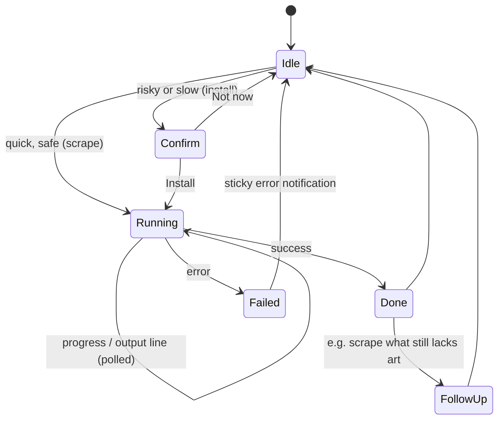

# Shelf Design System

**Version 1.0 · October 2026 · Built on [GPUI Kit](https://gpui-kit.com) 0.7.1**

Shelf is the design system behind RetroPie ROM Manager, written down so the next desktop app can start from it instead of from scratch. It's for small, focused Rust desktop tools built with GPUI Kit that manage a *collection*: things on disk with metadata, artwork and actions.

The name comes from the core idea: the app is a shelf, and the user's content is what's on it. The shelf itself stays quiet.

**Source of truth.** When this document and the code disagree, the code wins. Then fix this document. The reference implementation lives in:

| Area | File |
|---|---|
| Theme + accent | `src/theme.rs` |
| Icons + assets | `src/assets.rs` |
| App shell, state, async jobs | `src/ui/root.rs` |
| Sidebar | `src/ui/sidebar.rs` |
| Header, notices, toolbar, grid, list | `src/ui/library.rs` |
| Details sheet, dialogs | `src/ui/details.rs` |
| Visual reference (HTML) | `design/gpui-kit-mockup.html` |

---

## Contents

1. [Principles](#1-principles)
2. [Colour](#2-colour)
3. [Typography](#3-typography)
4. [Spacing, layout and elevation](#4-spacing-layout-and-elevation)
5. [Iconography](#5-iconography)
6. [Components](#6-components)
7. [Patterns](#7-patterns)
8. [Voice and content](#8-voice-and-content)
9. [Implementation guide](#9-implementation-guide)
10. [Adopting Shelf in a new app](#10-adopting-shelf-in-a-new-app)
11. [Appendix: quick reference](#11-appendix-quick-reference)

---

## 1. Principles

Five rules decide every call this document doesn't cover.

### 1.1 Flat on purpose
Depth comes from solid surfaces, 1 px borders and small neutral shadows. **No gradients, glows, gloss, coloured shadows or glassmorphism.** Those read as generic "AI-generated" UI, and they fight with the content. The first two versions of this design had them, and both were rejected.

### 1.2 Content carries the colour
Box art, screenshots and covers are the most colourful things on screen, and the chrome stays neutral so they can be. A screen with no content should look calm and grey, not empty-but-decorated.

### 1.3 One accent per context
Each context (in the reference app, each *system*) has exactly one flat accent colour. It marks *where you are* and *what to do next*: the context's icon tile, the selected-row marker and the single primary button. Nothing else.

### 1.4 Honest states
Never fake data. Never make up a description, never draw a placeholder that looks like real art, never claim something saved when it wasn't. Each state says what is true: *not scraped yet*, *no match*, *off in settings*, *not found*.

### 1.5 Native, not a web page
It's a desktop tool. It uses the native title bar, system font and native file dialogs. Keyboard shortcuts work, dropping files onto the window works, and long-running work happens in the background while the app stays usable.

---

## 2. Colour

Shelf uses GPUI Kit's **Default Dark** and **Default Light** themes (shadcn's *neutral* palette) unchanged, and adds one thing on top: the context accent.

### 2.1 Neutral tokens

Read them in code with `cx.theme().<field>` (`ActiveTheme` trait). Values are the kit defaults.

| Token | Dark | Light | Used for |
|---|---|---|---|
| `background` | `#0a0a0a` | `#ffffff` | Window background, sheet and dialog body |
| `foreground` | `#fafafa` | `#0a0a0a` | Primary text, brand mark fill |
| `muted` | `#262626` | `#f5f5f5` | Placeholder art, chips for extensions, quiet fills |
| `muted_foreground` | `#a3a3a3` | `#737373` | Secondary text, captions, counts, icons in inputs |
| `secondary` | `#262626` | `#e5e5e5` | Base for card surfaces (see 2.4), secondary tags |
| `border` | `#262626` | `#e5e5e5` | All 1 px borders and dividers |
| `input` border | `#2f2f2f` | `#e5e5e5` | Input outlines |
| `sidebar` | `#0a0a0a` | `#fafafa` | Sidebar background |
| `sidebar_accent` | `#262626` | `#e5e5e5` | Sidebar row hover and selected fill |
| `sidebar_foreground` | `#f5f5f5` | `#171717` | Sidebar text (unselected rows at 80% opacity) |
| `table_head` | kit default | `#fafafa` | List view header row |
| `table_hover` | kit default | `#f5f5f5` | List view row hover |
| `drop_target` | `#3b82f619` | `#3b82f640` | Window tint while files are dragged over it |
| `ring` | → accent | → accent | Focus ring (overridden by the accent, 2.2) |

**Never hard-code a neutral.** If a value isn't in the theme, build it from a token (`t.border.opacity(0.7)`), not a hex.

### 2.2 The accent

Each context gets one accent. The reference app's six accents were tuned to carry **white text and a white icon** and to read on **both** themes:

| Context | Hex | Swatch use |
|---|---|---|
| Arcade (MAME) | `#e0663a` | orange |
| Dreamcast | `#d9475b` | rose |
| Game Boy Advance | `#8f63cf` | violet |
| Sega Genesis / MD | `#3a7bd5` | blue |
| PlayStation | `#5b6ee1` | indigo |
| Nintendo 64 | `#2c9a63` | green |

When the context changes, `theme::apply_accent(color, cx)` writes the accent into the theme, so kit components pick it up with no extra code:

| Theme field | Value |
|---|---|
| `primary`, `button_primary`, `ring`, `sidebar_primary`, `progress_bar` | accent |
| `primary_hover`, `button_primary_hover` | accent at 90% opacity |
| `primary_active`, `button_primary_active` | accent darkened 10% |
| `primary_foreground`, `button_primary_foreground` | white |

**Where the accent appears**

- The context's icon tile (sidebar row, page header, empty state, Add tile)
- The selected sidebar row's 3 px marker
- The **one** primary button in view (*Add ROM*, *Scrape N*, *Install Skyscraper*)
- Progress bars and focus rings
- Accent notices (2.5)

**Where it never appears:** text, borders of ordinary components, card backgrounds, icons outside a tile, large fills.

**Choosing accents for a new app**

1. Pick hues that are clearly different from each other at a glance (6 is a comfortable maximum).
2. Each one must hold **white text at ≥ 4.5:1** contrast. Medium-dark, moderately saturated colours, roughly HSL lightness 45–55% and saturation 50–70%.
3. Test it on both `#0a0a0a` and `#ffffff`. It must be visible on both, without glowing on dark or looking washed out on light.
4. No neon, no pastel, no near-black. The original PlayStation accent `#444466` disappeared on dark backgrounds and had to be replaced.
5. An app with no natural contexts uses **one** brand accent everywhere.

### 2.3 Status colours

Use the kit's status tokens, never custom reds and greens:

| Token | Use |
|---|---|
| `danger` | Delete buttons, failed notifications, destructive confirm button |
| `warning` | "Needs attention" notices (missing tool, app conflict), *No art* / *No match* tags |
| `success` | Success notifications |
| `info` | Neutral informational alerts |

A status colour is never decoration. If it's red, something can be lost; if it's amber, something needs attention.

### 2.4 Derived surfaces

Shelf has exactly three derived colours. Don't add a fourth without updating this table.

| Name | Formula | Where |
|---|---|---|
| Card surface | `secondary @ 45%` (`theme::card_bg`) | Media cards, list view container |
| Card border | `border @ 70%`, full `border` on hover | Cards, list rows, list container |
| Notice tint | background `tone @ 8%`, border `tone @ 35%` | Notice rows (`tone` = accent or `warning`) |

### 2.5 Overlays and tints

- **Dialogs and sheets** use the kit's own overlay. Don't add another scrim.
- **Drop target:** the whole content column takes `drop_target` while files are dragged over it.
- **Hover:** a neutral step (`sidebar_accent`, `table_hover`, `muted @ 40%`). Never accent-tinted.

### 2.6 Light and dark

Both themes are first-class. The app starts in **Dark** (most use is on a TV-connected Pi in a dim room) and the sidebar footer toggles it. `theme::toggle_mode` switches mode **and re-applies the accent**, because a mode change reloads the kit's colours.

Every screen must be checked in both. If something only works in one, it's wrong.

---

## 3. Typography

### 3.1 Families

| Role | Family | Notes |
|---|---|---|
| UI | `.SystemUIFont` | The kit's system font: SF on macOS, Noto Sans on Linux (the kit picks the installed family) |
| Mono | `theme.mono_font_family` | File names, paths, extensions, installer output |

Never bundle a display or pixel font for chrome. A "retro" app doesn't need a retro UI font; the box art already says retro.

### 3.2 Scale

GPUI's `rem` is the theme's `font_size` (16 px). Use the named helpers, not raw sizes, except where the table says otherwise.

| Style | Helper | Size | Weight | Used for |
|---|---|---|---|---|
| Page title | `text_2xl()` | 24 | Semibold | Context name in the page header |
| Sheet title | `text_xl()` | 20 | Semibold, line height 1.2 | Game title in the details sheet |
| Section heading | `text_base()` | 16 | Semibold | "Library" |
| Body / card title | `text_sm()` | 14 | Semibold for titles, regular for body | Card titles, sidebar rows, notice text, descriptions |
| Caption / meta | `text_xs()` | 12 | Regular or Medium | Counts, tags, section labels, byline, file sizes |
| Monogram | `text_size(px(40.))` | 40 | Bold | Placeholder art initials |
| Box-art monogram | `text_size(px(30.))` | 30 | Bold | Placeholder in the sheet's box art |

Weights: **Regular** for reading, **Medium** for the selected row and table headers, **Semibold** for titles and names, **Bold** only for monograms.

### 3.3 Rules

- **Sentence case everywhere:** buttons, titles, headings, menu items. "Add ROM", not "Add Rom" or "ADD ROM". Proper nouns and acronyms keep their case.
- **Long descriptions** use line height 1.6 at `text_sm`, in `muted_foreground`.
- **Truncate, don't wrap** in fixed-height rows: sidebar labels, list titles, file names (`.truncate()` with `min_w_0()` on the flex child).
- **Clamp card titles to two lines** in a fixed 38 px block (`line_clamp(2)`), so card rows stay aligned.
- **Mono only for literal computer strings:** file names, paths (`~/RetroPie/roms/psx/`), extensions (`.cue`), command output.
- **Numbers** sit in their own element so they align: counts on the right of sidebar rows, the files column in the list view.

---

## 4. Spacing, layout and elevation

### 4.1 Spacing scale

A 4 px grid. Use the GPUI helpers.

| Helper | px | Typical use |
|---|---|---|
| `gap_1` / `p_1` | 4 | Chips in a row, icon + count |
| `gap_1p5` | 6 | Header stat tags, progress label to bar |
| `gap_2` / `p_2` | 8 | Button groups, card internals |
| `gap_2p5` | 10 | Sidebar row: tile to label |
| `gap_3` / `p_3` | 12 | Card padding, notice internals, list row columns |
| `gap_4` / `p_4` | 16 | Header: tile to text, Add tile padding |
| `gap_5` | 20 | Between page sections, between sheet sections |
| `p(24)` | 24 | Content column padding |

Use 14 px for the card grid gap (`GRID_GAP`). It's the one deliberate off-grid value, because it balances 196 px cards better than 12 or 16.

### 4.2 Window layout

```
┌───────────────────────────── native title bar ─────────────────────────────┐
│┌────────────┐┌─────────────────────────────────────────────────────────────┐│
││ Brand mark ││  [tile] Page title                     [▢] [Scrape] [+ Add] ││
││            ││         subtitle · [7 games] [24 files] [roms/psx]          ││
││ SYSTEMS    ││                                                             ││
││ ▌[■] Row   ││  ┌ Notice row ─────────────────────────────── [Action] ┐   ││
││  [■] Row   ││  └─────────────────────────────────────────────────────┘   ││
││  [■] Row   ││                                                             ││
││            ││  Library 7                       [Search … /] [▦|☰]        ││
││            ││  ┌──────┐ ┌──────┐ ┌──────┐ ┌──────┐                        ││
││            ││  │ Add  │ │ card │ │ card │ │ card │   ← grid / list         ││
││            ││  └──────┘ └──────┘ └──────┘ └──────┘                        ││
││ ────────── ││                                                             ││
││ Folder About ☾││                                                          ││
│└────────────┘└─────────────────────────────────────────────────────────────┘│
└─────────────────────────────────────────────────────────────────────────────┘
          240 px                 content column, scrolls, 24 px padding
```

Overlays sit above this: **sheet** (right edge, 440 px), **dialogs** (centred) and **notifications** (top right). They come from the kit's Root layers, so you never render them yourself.

### 4.3 Key dimensions

| Element | Size |
|---|---|
| Default window | 1280 × 800 |
| Minimum window | 1024 × 680 |
| Sidebar width | 240 |
| Content padding | 24 |
| Page header icon tile | 52 × 52 |
| Sidebar row height | 36 |
| Card minimum width | 196 (columns grow to fill) |
| Card art height | 118 |
| Card title block | 38 (two lines) |
| Add tile minimum height | 228 (art + 110) |
| List row height | 54 |
| List header height | 34 |
| Search field width | 240 |
| Sheet width | 440 |
| Sheet banner (screenshot) | 180 high |
| Sheet box art | 96 × 128 |
| Header progress bar width | 380 |

### 4.4 Responsive grid

Cards fill the width with as many columns as fit at ≥ 196 px:

```rust
let available = viewport_width - SIDEBAR_WIDTH - 2.0 * CONTENT_PADDING;
let columns = ((available + GRID_GAP) / (CARD_MIN_WIDTH + GRID_GAP)).floor().max(1.0) as u16;
div().grid().grid_cols(columns).gap(px(GRID_GAP))
```

At the default window that's 4 columns plus the Add tile in the first slot. Never use fixed-width cards with `flex_wrap`; it leaves ragged gaps on the right.

### 4.5 Corner radius

| Token | px | Use |
|---|---|---|
| `theme.radius` | 6 | Buttons, inputs, sidebar rows, small tiles, file tables, box art |
| `theme.radius_lg` | 8 | Cards, list container, notices, sheet banner, dialogs, notifications |
| Tile radius | ≈ 23–25% of the tile size | 24 → 6 · 28 → 7 · 32 → 8 · 40/44 → 10 · 52 → 12 · 56 → 14 |
| Tag / badge | 4–5 | Extension chips, system badge on art |

Squircle-ish tiles (≈ 24% radius) are part of the look. Don't use circles for tiles, and don't use pills for buttons.

### 4.6 Elevation

Three levels. Higher levels are brighter (dark mode) or whiter (light mode) and carry the kit's default shadow; nothing else changes.

| Level | Surfaces | Treatment |
|---|---|---|
| 0 · Base | Window, content column | `background` |
| 1 · Raised | Sidebar, cards, list container, notices | Card surface + card border (sidebar: `sidebar` + `sidebar_border`) |
| 2 · Floating | Sheet, dialogs, notifications, tooltips, popovers | Kit popover surface + kit shadow + kit overlay |

The only extra shadow outside the kit is `shadow_md()` on the sheet's box art, so it lifts off the screenshot banner.

---

## 5. Iconography

### 5.1 Library
**[Lucide](https://lucide.dev)**, through GPUI Kit (`gpui_kit::assets::IconName`): 24 × 24 grid, 2 px stroke, round caps. Every UI icon comes from Lucide, so the app matches the kit's own components.

Domain glyphs (one per context, e.g. a console) can come from a second, compatible set. The reference app uses **Tabler** glyphs from `assets/icons/*.svg`, which share Lucide's 24 px grid and 2 px stroke. Don't mix in filled or duotone sets.

### 5.2 Sizes

| Size | px | Helper | Where |
|---|---|---|---|
| XSmall | 12 | `.xsmall()` | Inside tags and file rows |
| Small | 14 | `.small()` | Inputs, notices, small buttons, sidebar tile glyphs |
| Medium | 16 | default | Buttons, toolbar |
| Custom | 18 / 20 / 26 / 28 | `.with_size(px(..))` | Brand mark, Add tile, page header tile, empty state |

### 5.3 The icon tile

The signature element. A **solid accent square** with a **white monochrome glyph** centred in it. It means "this context" or "the primary action".

| Placement | Tile | Glyph | Radius |
|---|---|---|---|
| Sidebar row | 24 | 14 | 6 |
| Notice row | 28 | 14 | 7 |
| Brand mark (inverted: `foreground` tile, `background` glyph) | 32 | 18 | 8 |
| About dialog mark | 40 | 20 | 10 |
| Add tile | 44 | 20 | 10 |
| Page header | 52 | 26 | 12 |
| Empty state | 56 | 28 | 14 |

```rust
system_tile(system, px(52.), px(26.), px(12.))   // src/ui/sidebar.rs
```

Rules:

- The glyph is always white (or `background` on the inverted brand mark). Never a coloured glyph on a white tile.
- No borders, shadows or gradients on tiles.
- A tile is never decoration. It stands for a context or a primary action.

### 5.4 Domain glyphs from disk
Context glyphs are plain SVG files drawn as **single-colour masks**, so their own stroke colour is ignored and they take whatever colour the UI gives them:

```rust
svg().external_path(path).size(px(14.)).text_color(white())
```

If the file is missing, fall back to a Lucide icon (`Gamepad2`). The UI must never show a broken icon.

### 5.5 Registering icons
The kit's default bundle covers about 100 Lucide icons. Anything else has to be listed once in `src/assets.rs`:

```rust
gpui_kit::assets::icon_assets!(ExtraIcons, [Trash, LayoutGrid, List, ImageDown, ImageOff, Gamepad2, Upload, X, VideoOff, Files, Download]);
```

An unregistered icon renders as **nothing**, with no error. When you add an icon, check it on screen.

### 5.6 Vocabulary

| Meaning | Icon |
|---|---|
| Add | `Plus` |
| Delete | `Trash` |
| Open folder | `FolderOpen` (`Folder` for a path chip) |
| Fetch artwork | `ImageDown` |
| Re-fetch | `RefreshCw` |
| Install a tool | `Download` |
| Missing image | `ImageOff` |
| Missing video | `VideoOff` |
| Search | `Search` |
| Grid / list view | `LayoutGrid` / `List` |
| File / file count | `File` / `Files` |
| Info / About | `Info` |
| Theme | `Moon` (dark active) / `Sun` (light active) |

Banned: `Sparkles` and other "magic" icons. They read as AI features. Fetching metadata is a download, so show a download.

---

## 6. Components

Each entry gives the GPUI Kit base, anatomy, specs, states and rules. Where the kit has a component, use it. Build a custom component only where the kit can't do the job, and note why.

### 6.1 App shell
- **Base:** `gpui_kit::open_window` (wraps the view in the kit's `Root`, which mounts sheet, dialog, notification and tooltip layers).
- **Structure:** a `flex_row` of sidebar plus content column. The content column is a `v_flex` with `overflow_y_scrollbar()`.
- **Title bar:** native. Its title is the app name.
- **Focus:** the root view tracks a focus handle under a key context (`"RomManager"`), so app shortcuts work anywhere.

### 6.2 Sidebar
- **Base:** kit `Sidebar` (`collapsible(false)`, `w(px(240.))`) with a **custom row type** (`SystemRow` implements `SidebarItem` + `Collapsible`), because the kit's `SidebarMenuItem` only accepts a plain icon, not a tile.
- **Header:** brand mark (32 inverted tile) + app name (`text_sm` semibold) + "for RetroPie · v1.1.0" (`text_xs` muted), then a "Systems" group label (`text_xs` medium muted).
- **Row:** 36 high, `px_2`, `gap_2p5`, `radius`; tile 24 / glyph 14 / radius 6 · label `text_sm`, truncates · count `text_xs` on the right.
- **States**

| State | Fill | Text | Extras |
|---|---|---|---|
| Rest | none | `sidebar_foreground @ 80%` | count in `muted_foreground` |
| Hover | `sidebar_accent` | same | — |
| Selected | `sidebar_accent` | `sidebar_accent_foreground`, Medium | 3 px accent marker on the left edge, top/bottom inset 10 |

- **Footer:** ghost small buttons, *Folder* and *About* on the left, theme toggle (icon only, tooltip) on the right.
- **Rule:** the sidebar lists contexts only. Actions go in the page header.

### 6.3 Page header
- **Anatomy:** 52 tile · title (`text_2xl` semibold) · one-line subtitle (`text_sm` muted) · stat tags · optional progress block · action buttons on the right.
- **Stat tags:** `Tag::secondary().small()`, for example "7 games", "24 files", and the folder (Folder icon + "roms/psx"). Plurals are always correct (8.2).
- **Progress block** (only while that context's job runs): 380 wide, label row (`text_xs` muted, "Scraping with Skyscraper" ← → "3 / 8" in `foreground`), then kit `Progress` (0–100).
- **Actions, left to right:** icon-only outline (open folder, with tooltip) → outline secondary (*Scrape*, `loading` while running, disabled with a reason in the tooltip when unavailable) → **primary** (*Add ROM*).

### 6.4 Buttons

| Rank | Kit variant | Use | Limit |
|---|---|---|---|
| Primary | `.primary()` (accent) | The main next step | **One per view** (a notice's action counts as the one for that notice) |
| Secondary | `.outline()` | Other actions in a header or panel | — |
| Tertiary | `.ghost()` | Footer and sidebar utilities, list row actions | — |
| Destructive in place | `.danger().outline()` | *Delete* in a sheet footer | — |
| Destructive confirm | `ButtonVariant::Danger` | Only the confirm button of a delete dialog | — |

- **Labels:** verb first, sentence case, specific ("Delete files", "Install Skyscraper", "Scrape 3"). See 8.3.
- **Icon + label** for primary and secondary. **Icon-only** buttons always get a tooltip.
- **Disabled** buttons explain why in a tooltip, or the reason shows in a nearby notice.
- **Loading:** `.loading(true)` swaps in a spinner and blocks clicks. Use it on the button that started the job.

### 6.5 Notice row
A one-line, full-width banner between the header and the toolbar. **At most one is shown**, picked by priority (7.8).

- **Two flavours**
  - **Kit `Alert`** (`Alert::warning(id, text).title(..)`): for notices with no action.
  - **Custom `notice_row`**: the kit's `Alert` has no action slot, so notices with a button use this instead.
- **`notice_row` anatomy:** 28 tile (tone fill, white 14 glyph, radius 7) · lead line (`text_sm` semibold) · one sentence (`text_sm` muted) · optional button on the right (`primary().small()`).
- **Tone:** the accent for "you can improve this" (*3 games without artwork*). `warning` for "something is missing or in the way" (*Box art needs Skyscraper*).
- **Tint:** background at 8% of the tone, border at 35% (2.4), radius `radius_lg`, padding 16 × 12.
- **Live variant:** a long job shows elapsed time in the lead ("Installing Skyscraper · 3:12") and its latest output line in mono `text_xs` after a small `Spinner`.

### 6.6 Search field
- **Base:** kit `Input` + `InputState` (placeholder "Search games"), 240 wide.
- **Prefix:** `Search` icon (small, muted). **Suffix:** `Kbd` showing `/`. `cleanable(true)`.
- **Behaviour:** filters as you type (case-insensitive substring on the full name). `/` focuses it from anywhere. Switching context clears it.
- **Feedback:** the toolbar count becomes "2 of 7". No matches shows the *No matches* empty state (7.1).

### 6.7 View toggle
- **Base:** kit `ButtonGroup` with `.outline()`: two icon buttons (`LayoutGrid`, `List`), each with a tooltip, `selected` on the active one.
- The view mode is per session, not per context.

### 6.8 Media card
The main component. One per entity (game).

```
┌────────────────────────────┐
│ [■ PS1]            [Trash] │ ← system badge · delete (on hover)
│        box art / initials  │   118 px, object-fit: cover
├────────────────────────────┤
│ Title of the game that may │ ← text_sm semibold, 2-line clamp, 38 px
│ wrap to two lines          │
│ [1998] [Racing]            │ ← facts row (tags)
│ ★★★★☆               ⧉ 3 files│ ← rating · file count
└────────────────────────────┘
```

- **Container:** `radius_lg`, card surface, card border (full `border` on hover), clickable (opens the details sheet), `group("card")`.
- **Art:** `img(PathBuf)` with `ObjectFit::Cover`, and `with_loading` + `with_fallback` both showing the **initials tile** (neutral `muted` fill, 40 px bold initials in `muted_foreground`). Unscraped games show the same tile, plus the context glyph at 8% opacity, oversized and cropped in the top-right corner.
- **System badge:** top-left, `background` fill, 1 px `border`, radius 5, `text_xs` medium muted, 11 px glyph + short name ("PS1").
- **Delete:** top-right, outline small icon button on a `background` backing, `invisible()` until the card is hovered (`group_hover`). The click handler calls `cx.stop_propagation()` so it doesn't also open the card.
- **Body:** `p_3`, `gap_2`.
  - Facts row
    - Scraped: year tag + first genre tag.
    - Not scraped: up to two name tags ("USA", "Rev 1") + a `Tag::warning` reading *No art* or *No match*.
  - Bottom row: kit `Rating` (xsmall, disabled, whole stars) on the left, `Files` icon + "3 files" on the right.
- **Rules**
  - The title is the *clean* title ("Doom"). Region and revision go in tags, never in the title.
  - Never put more than two facts in the facts row. Everything else belongs in the details sheet.

### 6.9 Add tile
The first grid cell (hidden while searching): dashed 1 px `border`, `radius_lg`, minimum height 228, centred column with 44 accent tile + white `Plus` · "Add ROM" (`text_sm` semibold) · "Click or drop files" (`text_xs` muted) · accepted extensions as mono `text_xs` chips (`muted` fill, radius 4), wrapping at 170 px. On hover the border turns `muted_foreground` and the fill `muted @ 40%`.

### 6.10 List view
A dense alternative to the grid, for scanning and deleting.

| Column | Width | Content |
|---|---|---|
| Thumb | 36 | Cover (radius 6) or initials |
| Title | flex | Title (`text_sm` medium, truncates) + byline (`text_xs` muted): "1998 · Namco", "Not scraped yet", "No match on ScreenScraper" |
| Details | 200 | Genre tag + rating, or name tags |
| Files | 56 | Count |
| Action | 32 | Ghost small `Trash` icon button with tooltip |

The container uses the card surface and border with `radius_lg`. The header row is 34 high, `table_head`, `text_xs` medium muted. Rows are 54 high, separated by a top border at 70%, and fill with `table_hover` on hover. A row click opens the details sheet.

### 6.11 Tags
`Tag::secondary().small()` for neutral facts (year, genre, region, counts). `Tag::warning().small()` for problems (*No art*, *No match*). Nothing else: no coloured category tags, no accent tags.

### 6.12 Rating
Kit `Rating`, read-only (`disabled(true)`), whole stars: `round(rating × 5)`. Size `xsmall` on cards and in the list, `small` in the sheet, where the exact score sits beside it as text ("3.9 / 5").

### 6.13 Progress and spinners
- **Determinate** (the job reports counts): kit `Progress` in the page header, with the "done / total" text beside it.
- **Indeterminate** (no counts): kit `Spinner` beside the latest status line, inside the live notice.
- The button that started the job shows `loading`.

### 6.14 Empty states
Kit `Empty` with `EmptyHeader` (media, title, description) and optional `EmptyContent`.

| Case | Media | Title | Description | Content |
|---|---|---|---|---|
| Context has no items | context tile 56 | "No PlayStation games yet" | Where items go + one helpful fact | Primary "Add your first ROM" + extension chips |
| Search finds nothing | `Search` icon | "No matches" | "Nothing in PlayStation matches “tek”." | — |

### 6.15 Details sheet
- **Base:** `window.open_sheet` (kit `Sheet`, right side), `size(px(440.))`, built from an owned **snapshot** (9.6).
- **Anatomy, top to bottom**
  1. Screenshot banner (180 high, `radius_lg`), only if a screenshot exists.
  2. Head: box art 96 × 128 (radius 6, 3 px `background` border, `shadow_md`), pulled up 56 px over the banner with a 12 px left inset when there is one. Beside it: title (`text_xl` semibold), byline (`text_sm` muted: "id Software · 1995"), name tags.
  3. Description (`text_sm`, line height 1.6, muted), or *"No description in gamelist.xml."* in italic. Never a generated sentence.
  4. **Details:** kit `DescriptionList` (1 column, label width 96, no borders), with Released, Developer, Publisher, Genre, Players (en dash for ranges, "1–2") and Rating. The source ("ScreenScraper") sits on the right of the section label.
  5. **Media:** four equal tiles (64 high) for Box art, Screenshot, Marquee and Video. A saved item shows the image; a missing one shows a dashed tile with `ImageOff` or `VideoOff`. Caption: label + "Saved", "Off in skyscraper.cfg" or "Not found". The section label's aside reads "2 of 4 saved".
  6. **Files:** bordered table, `text_xs`. One row per file (`File` icon, mono name truncating, size right-aligned), plus a last row on a `muted @ 50%` fill with the folder path. Aside: "10 files · 592 MB".
- **Section labels:** `text_xs` semibold muted, with an optional muted aside on the right. Sections are 20 apart.
- **Footer:** ghost "Show in folder" on the left · spacer · outline "Re-scrape" (or "Scrape" if never scraped; disabled while a job runs or the tool is missing) · danger outline "Delete".
- **Unscraped variant:** sections 3–5 are replaced by one `Alert::info`: "No artwork yet. Scrape to fetch…" or "No match on ScreenScraper. Renaming the file to its No-Intro/Redump name usually fixes this."

### 6.16 Dialogs
- **Confirmation** (`window.open_alert_dialog`, `.confirm()`): title as a question ("Delete Doom?", "Install Skyscraper?"), one description sentence with the consequence, optional content (a mono file list: first 6 files + "+ N more", max 140 high), a cancel label that keeps things as they are ("Cancel", "Not now"), and an OK label that names the action ("Delete files", "Install"). Destructive OK uses `ButtonVariant::Danger`. The backdrop never dismisses it.
- **Information** (`window.open_dialog`): About uses a 40 px inverted mark + one sentence + `DescriptionList` (Version, ROMs folder, Artwork, Developer, Copyright, License) + a right-aligned "Close" button in the footer.

### 6.17 Notifications
`window.push_notification(Notification::<type>(message).title(title))`, top right, auto-hide.

| Type | When | Example title / message |
|---|---|---|
| `success` | A user action finished | "Installed Doom.zip" / "extracted 9 file(s) → …" |
| `error` | It failed | "Couldn't install Doom.zip" / the reason |
| `warning` | Finished, but with a catch | "EmulationStation is running" / "artwork cached — quit … and scrape again" |

Use `.autohide(false)` only for failures that need reading (a failed tool install). Send one notification per item, not one per batch, so a single failure can't hide among successes.

### 6.18 Tooltips
Required on every icon-only button and every disabled button. Plain sentence fragments ("Open in file manager", "Fetch box art & metadata for every game"). Never repeat a visible label.

---

## 7. Patterns

### 7.1 Content states
Every entity view handles all of these. None of them may look like another.

| State | Card | List row | Details sheet | Notice |
|---|---|---|---|---|
| Loading art | Initials tile | Initials thumb | Initials box art | — |
| Scraped | Cover + year/genre + rating | Cover, "1998 · Namco", genre + rating | Full | — |
| Not scraped | Initials + name tags + *No art* | "Not scraped yet" | Info alert + Scrape | "N games without artwork" + Scrape N |
| No match | Initials + name tags + *No match* | "No match on ScreenScraper" | Info alert with the rename tip | Not counted (asking again won't help) |
| Media missing / off | — | — | Dashed tile, "Not found" / "Off in skyscraper.cfg" | — |
| Image unreadable | Initials (fallback) | Initials | Initials | — |
| Empty context | — | — | — | Empty state (6.14) |
| No search results | — | — | — | "No matches" empty state |

### 7.2 Long-running background work
Scraping and installing tools take seconds to minutes. The pattern:



1. **One job of a kind at a time.** The state lives in the root view (`scrape: Option<ScrapeJob>`, `setup: Option<SetupJob>`), and starting again while one runs is a no-op.
2. **The work runs off the UI thread** (`cx.background_spawn`). The UI stays fully usable.
3. **Progress goes through a shared cell** (`Arc<Mutex<…>>`) that the job writes and a UI task polls every 250–500 ms, then calls `cx.notify()`. Never block on the job.
4. **Show progress where the user is looking:** the header progress bar for per-item jobs, the live notice for tool installs (elapsed time + latest output line).
5. **The trigger button shows `loading`.** Related buttons disable with a reason.
6. **When it ends:** clear the state → `refresh()` from disk → push a notification → start a follow-up if it's the obvious next step.
7. **Parse real progress if the tool emits it** (Skyscraper prints `#3/8`), and strip ANSI codes from anything shown.

### 7.3 Destructive actions
- Always confirm, and say exactly what will go: "10 files will be permanently removed from ~/RetroPie/roms/psx, along with its scraped artwork."
- Show the list (first 6 + "+ N more").
- Delete exactly what was listed when the view was built, never a fresh re-scan. That way a background change can't make you delete something else.
- Only delete inside known folders. Media cleanup refuses paths outside the scraper's media folders.
- Close any sheet showing the deleted item, refresh, and notify with the counts.

### 7.4 Privileged actions (root)
- **Never at launch, never without a click.** A surprise password prompt is hostile.
- Confirm first. Say what runs, that a password may be asked for, and how long it takes ("10–20 minutes on a Raspberry Pi").
- Use the least intrusive method that works: passwordless `sudo -n`, then `pkexec` (the desktop's own prompt), then show the exact command to run by hand.
- Keep the real user's identity (`env __user=$USER …`). Root installing things "for root" is a classic bug.
- Stream output, show elapsed time, and make failures sticky with the last error line.

### 7.5 External tool dependencies
When a feature needs an external tool (Skyscraper):

1. Detect it at startup and on every `refresh()`, cheaply (file exists on known paths, then `$PATH`).
2. If it's missing, the feature's buttons disable with a reason and a notice explains it.
3. If the app can install it, the notice offers **Install**. If it can't, the notice gives the exact manual command.
4. After installing, re-detect and continue the original intent.

### 7.6 Drag and drop
The whole content column is a drop target (`drag_over::<ExternalPaths>` tints it `drop_target`, and `on_drop` installs each path). The Add tile says "Click or drop files" so people know it's possible. Each file gets its own result notification.

### 7.7 Keyboard

| Key | Action |
|---|---|
| `/` | Focus search |
| `Esc` | Close the open sheet or dialog (kit default) |
| `Enter` / `Esc` in dialogs | Confirm / cancel (kit default) |
| `Tab` | Move focus (kit default) |

Bind app keys to the root key context: `KeyBinding::new("/", FocusSearch, Some("RomManager"))`.

### 7.8 Notice priority
Only the highest-priority notice shows:

1. A tool install in progress (live)
2. A required tool is missing (install offer or manual command)
3. A conflicting app is running (e.g. EmulationStation would overwrite our changes)
4. Items need attention ("N games without artwork"), hidden while a job is already handling them

### 7.9 Multi-part entities
One logical item may be many files (a `.cue` + 8 track `.bin`s + a save file). Show **one** entry, count its files ("10 files"), list them all in the details sheet, act on the *anchor* file (`.cue`/`.gdi`/`.m3u`) for external tools, and delete all of them together.

### 7.10 Theme switching and accent changes
Switching context or theme re-applies the accent through `theme::apply_accent`, so every kit component recolours on the same frame. Never cache theme colours across renders; read `cx.theme()` in `render`.

---

## 8. Voice and content

### 8.1 Tone
Plain, specific, calm. Say what happened and what to do, in the user's terms. No marketing, no exclamation marks, no "Oops!", no emoji.

### 8.2 Numbers, plurals, units
- Always pluralise correctly: "1 game", "2 games", "1 file". Use the `plural(n, word)` helper; never write "game(s)" in new UI.
- Sizes like a file manager: "344 B", "80 KB", "2.0 MB", "449 MB", "1.2 GB" (`library::format_size`).
- Ranges with an en dash: "1–2 players", "10–20 minutes".
- Counts in context: "2 of 7" while filtering, "3 / 8" for progress.
- Paths start from home: `~/RetroPie/roms/psx`, not `/home/pi/...`.

### 8.3 Copy formulas

| Element | Formula | Example |
|---|---|---|
| Button | Verb + object | "Add ROM", "Delete files", "Scrape 3", "Install Skyscraper" |
| Notice lead | State, as a short fact | "Box art needs Skyscraper", "3 games without artwork" |
| Notice body | One sentence: why it matters or what to do | "Scrape them to get box art and descriptions here and in EmulationStation." |
| Dialog title | The action as a question | "Delete Doom?", "Install Skyscraper?" |
| Dialog body | Consequence + scale + reversibility | "10 files will be permanently removed from … This can't be undone." |
| Success title | Past tense + object | "Installed Doom.zip", "Removed Doom", "Scraped PlayStation" |
| Failure title | "Couldn't" + verb + object | "Couldn't install Doom.zip", "Scrape failed" |
| Empty title | "No <things> yet" | "No Arcade (MAME) games yet" |
| Missing value | Say it's missing, and where from | "No description in gamelist.xml." |

### 8.4 Good and bad

| Instead of | Write |
|---|---|
| "Oops! Something went wrong 😕" | "Couldn't install Doom.zip" + the actual reason |
| "8 game(s) installed" | "8 games installed" |
| "Magic metadata ✨" | "Fetch box art & metadata" |
| "Are you sure?" | "Delete Doom?" + what will be deleted |
| "Error: ENOENT" | "Skyscraper isn't installed" + how to get it |
| An invented description | "No description in gamelist.xml." |
| "OK" / "Cancel" on a delete | "Delete files" / "Cancel" |

---

## 9. Implementation guide

### 9.1 Dependencies

```toml
[dependencies]
gpui-kit = "0.7.1"   # pins the exact GPUI snapshot; bump this one line to move both
anyhow = "1"
```

`gpui-kit` re-exports GPUI as `gpui_kit::*`. Don't also depend on `gpui` directly.

Imports:

```rust
use gpui_kit::*;                                   // GPUI
use gpui_kit::prelude::FluentBuilder;              // .when / .when_some / .map
use gpui_kit::component::{h_flex, v_flex, ActiveTheme, StyledExt, Sizable, Icon, WindowExt};
use gpui_kit::assets::IconName;                    // full Lucide set; don't glob-import component::IconName too
```

`StyledExt` provides `font_semibold()` and friends; `FluentBuilder` provides `.when()`. Both are easy to forget.

### 9.2 Bootstrap

```rust
fn main() {
    gpui_kit::application()
        .with_assets(assets::AppAssets)                 // no icons render without this
        .run(|cx| {
            gpui_kit::init(cx);                         // before open_window
            Theme::change(ThemeMode::Dark, None, cx);
            Theme::update(cx, |t| t.sheet.margin_top = px(0.));   // native title bar → full-height sheets
            cx.bind_keys([KeyBinding::new("/", ui::FocusSearch, Some(ui::KEY_CONTEXT))]);
            gpui_kit::open_window(options, cx, |window, cx| cx.new(|cx| RootView::new(window, cx)))
                .expect("failed to open window");
            cx.activate(true);
        });
}
```

### 9.3 Theme module
Copy `src/theme.rs`. It's about 50 lines: `accent(u32) -> Hsla`, `apply_accent(u32, cx)`, `toggle_mode(accent, window, cx)` and `card_bg(cx)`. Call `apply_accent` when the view is created, on every context switch and after every mode change.

### 9.4 Assets
Copy `src/assets.rs`: the `icon_assets!` list plus an `AppAssets` source that checks your extra icons first, then the kit's default bundle. Domain SVGs load from disk (`assets/icons/<id>.svg`, then the packaged `/usr/share/<app>/assets`), with a Lucide fallback.

### 9.5 Module layout

```
src/
  main.rs          bootstrap only
  theme.rs         accent on top of the kit theme
  assets.rs        icons
  <domain>.rs      pure logic, no GPUI: listing, install, parsing — unit tested
  ui/
    mod.rs         re-exports RootView, actions, key context
    root.rs        state + actions + Render (thin)
    sidebar.rs     sidebar + shared tile/glyph helpers
    library.rs     header, notices, toolbar, grid, list, cards
    details.rs     sheet + dialogs
```

Rule: **domain modules never import GPUI.** Everything testable sits there; the UI only renders and dispatches.

### 9.6 Reusable helpers

| Helper | Where | What it does |
|---|---|---|
| `system_tile(sys, tile, glyph, radius)` | `ui/sidebar.rs` | Accent tile with a white glyph |
| `system_glyph(sys, size, color)` | `ui/sidebar.rs` | Disk SVG as a mask, or the Lucide fallback |
| `notice_row(tone, icon, lead, body, action, cx)` | `ui/library.rs` | Notice with an action slot |
| `initials_tile(bg, fg, initials)` | `ui/library.rs` | Art placeholder, loading and fallback |
| `plural(n, word)` | `ui/library.rs` | "1 game" / "2 games" |
| `format_size(bytes)` | `library.rs` | "2.0 MB" |
| `GameEntry::title_and_tags()` / `monogram()` | `library.rs` | "Doom (USA) (Rev 1)" → "Doom", ["USA", "Rev 1"] / "DO" |
| `theme::card_bg(cx)` | `theme.rs` | Card surface |

### 9.7 Overlay snapshots
Kit sheet and dialog builders are `Fn` closures **re-run on every render**. Build them from an owned snapshot taken when they open, and talk back to the root view through a `WeakEntity`:

```rust
let snapshot = Snapshot { entry: entry.clone(), meta, sizes: entry.file_sizes(), /* … */ };
let this = cx.entity().downgrade();
window.open_sheet(cx, move |sheet, _, cx| {
    sheet.size(px(440.)).child(render_body(&snapshot, cx)).footer(render_footer(&snapshot, this.clone()))
});
```

Never read files or run commands inside a builder. Compute sizes and status before opening.

### 9.8 Async jobs

```rust
let progress = Arc::new(Mutex::new((0usize, total)));
let poll = progress.clone();
cx.spawn(async move |this, cx| loop {                       // UI poller
    cx.background_executor().timer(Duration::from_millis(250)).await;
    let (done, total) = *poll.lock().unwrap();
    let running = this.update(cx, |this, cx| /* copy into state, cx.notify() */ ).unwrap_or(false);
    if !running { break; }
}).detach();
cx.spawn_in(window, async move |this, cx| {                 // the job
    let result = cx.background_spawn(async move { do_work(&|d, t| *progress.lock().unwrap() = (d, t)) }).await;
    this.update_in(cx, |this, window, cx| { /* clear state, refresh, notify, follow up */ }).ok();
}).detach();
```

Use `spawn_in(window, …)` when the completion needs `window` (notifications, dialogs).

### 9.9 Images
- Disk images: `img(PathBuf)`. A `&str` path is looked up in the asset source, not on disk.
- Always provide both `with_loading` and `with_fallback`. A card must never render blank.
- `ObjectFit::Cover` for art tiles, inside an `overflow_hidden` container with a fixed height.

### 9.10 Verifying the UI
- **Fixture home:** run the app with `HOME=/path/to/fixture` against a fake library (sparse files, a `gamelist.xml`, downloaded covers). Never test against a real user's library.
- **Debug-only launch switches** (compiled out of release builds) put the window into a state without clicking:

| Variable | Effect |
|---|---|
| `ROM_MANAGER_SYSTEM=psx` | Open on that context |
| `ROM_MANAGER_VIEW=list` | List view |
| `ROM_MANAGER_THEME=light` | Light theme |
| `ROM_MANAGER_OPEN=<index>` | Open that card's details sheet |
| `ROM_MANAGER_DIALOG=delete\|about\|install-skyscraper` | Open a dialog |
| `ROM_MANAGER_RUN=install-skyscraper\|scrape` | Start a job immediately |
| `ROM_MANAGER_SETUP_NO_ELEVATE=1` | Run the tool installer without sudo/pkexec (for stand-in scripts) |

- **Stand-in tools:** put a fake executable earlier on `PATH` that prints the real tool's progress format, to test progress and completion paths.
- **Screenshot every state** in section 7.1, in both themes, before calling a screen done.

---

## 10. Adopting Shelf in a new app

### 10.1 Setup checklist
- [ ] Add `gpui-kit`, copy `theme.rs` and `assets.rs`, and set up `main.rs` as in 9.2.
- [ ] Define your contexts (or one brand context) with an id, display name, short name, accent (2.2 rules) and glyph.
- [ ] Build the shell: kit `Sidebar` with your row type, content column with header → notice → toolbar → content.
- [ ] Put all domain logic in GPUI-free modules with unit tests.
- [ ] Implement every content state in 7.1 that applies, and the empty states in 6.14.
- [ ] Wire background jobs with the 7.2 pattern.
- [ ] Confirm every destructive action (7.3) and keep privileged actions behind a click (7.4).
- [ ] Add `/` for search and make sure `Esc` closes overlays.
- [ ] Add debug launch switches and a fixture home, then screenshot every state in both themes.

### 10.2 Review checklist
Run through this before merging UI work.

- [ ] No gradients, glows, coloured shadows or hard-coded hex neutrals.
- [ ] The accent appears only in tiles, the selected marker, the one primary button, progress and focus.
- [ ] One primary button per view.
- [ ] Every icon-only and disabled button has a tooltip.
- [ ] No fake data: every missing value says it's missing.
- [ ] Plurals are correct, sizes formatted, paths start with `~/`.
- [ ] Works and reads well in light and dark mode.
- [ ] Nothing blocks the UI thread; long jobs show progress and finish with a notification.
- [ ] Destructive actions list exactly what goes, and delete only that.
- [ ] Every new icon is registered and visible.
- [ ] Copy follows the formulas in 8.3.

### 10.3 Anti-patterns to reject

| Anti-pattern | Why | Instead |
|---|---|---|
| Purple-to-blue gradients, glow behind buttons, glossy highlights | Generic "AI" look; fights the content | Flat fills, 1 px borders |
| Sparkle icons for automation | Reads as an AI gimmick | Name the actual action: download, refresh |
| Equal-sized "stat card" grids | Generic; says little | A description list or inline tags |
| Coloured backgrounds on cards for variety | Fake content, noise | Neutral initials tile until real art exists |
| Several primary buttons | Nothing is primary | One primary, the rest outline or ghost |
| Placeholder text pretending to be data | Dishonest | "Not scraped yet", "No description" |
| Dashboard-style summary widgets in the sidebar | Clutter; duplicates the content | Counts on the rows |
| Prompting for a password at launch | Hostile surprise | A one-click, confirmed install |
| Fixed-width cards with `flex_wrap` | Ragged right edge | Computed `grid_cols` |

---

## 11. Appendix: quick reference

### 11.1 Tokens at a glance

```
Spacing   4 · 6 · 8 · 10 · 12 · 16 · 20 · 24        (grid gap 14)
Radius    6 (radius) · 8 (radius_lg) · tiles ≈ 24% of size
Type      24 title · 20 sheet title · 16 heading · 14 body · 12 meta · 40 monogram
Icons     12 · 14 · 16 · 18/20/26/28 in tiles
Tiles     24/14/6 · 28/14/7 · 32/18/8 · 44/20/10 · 52/26/12 · 56/28/14   (tile/glyph/radius)
Sizes     window 1280×800 (min 1024×680) · sidebar 240 · card ≥196, art 118 · row 54 · sheet 440
Tints     notice bg 8% · notice border 35% · card bg secondary 45% · card border 70%
```

### 11.2 Component → GPUI Kit map

| Shelf component | GPUI Kit | Custom? |
|---|---|---|
| App shell | `open_window` / `Root` | — |
| Sidebar | `Sidebar` | Row type (`SidebarItem`) for the accent tile |
| Page header | `Tag`, `Button`, `Progress` | Layout |
| Notice | `Alert` | `notice_row` when a button is needed |
| Search | `Input`, `InputState`, `Kbd` | — |
| View toggle | `ButtonGroup` | — |
| Media card | `Tag`, `Rating`, `Button` | Card layout, initials tile |
| List view | — | Rows (the kit `Table` is heavier than needed) |
| Empty state | `Empty` family | — |
| Details sheet | `Sheet`, `DescriptionList`, `Rating`, `Alert` | Banner + box art head, media tiles, file table |
| Confirm dialog | `AlertDialog` | — |
| Info dialog | `Dialog`, `DescriptionList` | — |
| Notifications | `Notification` | — |
| Spinner | `Spinner` | — |

### 11.3 Changelog

| Version | Date | Change |
|---|---|---|
| 1.0 | October 2026 | First version, extracted from RetroPie ROM Manager 1.1 after the GPUI Kit port. Replaces the earlier gradient-and-glow direction. |
